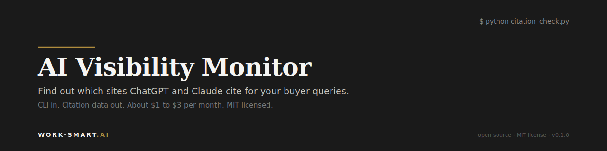
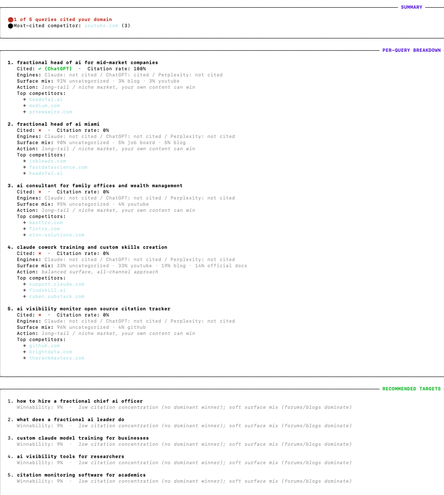

<p align="center">
  
</p>

<p align="center">
  <a href="LICENSE"></a>
  <a href="https://www.python.org/downloads/"></a>
  <a href="https://github.com/WorkSmartAI-alt/ai-visibility-monitor/stargazers"></a>
  <a href="https://github.com/WorkSmartAI-alt/ai-visibility-monitor/issues"></a>
  <a href="https://theresanaiforthat.com/ai/ai-visibility-monitor-by-work-smart-ai/"></a>
</p>

> **Your buyers ask ChatGPT, Claude, and Perplexity about your category before they call you.**
> **Want to see who they recommend instead?**

A CLI tool that runs your buyer queries through Claude, ChatGPT, and Perplexity with web search on, records every URL each engine cites, and tells you whether your domain showed up. You bring 5 questions your buyers actually ask. It returns the citation map across all three engines.

CLI in. JSON out. About $0.30 per run on the default model. No SaaS, no signup, no dashboard you'll forget about.

<p align="center">
  
</p>

## Table of contents

- [Why this exists](#why-this-exists)
- [Quick start](#quick-start)
- [What you get](#what-you-get)
- [How it works](#how-it-works)
- [Configuration](#configuration)
- [Authentication](#authentication)
- [How this compares](#how-this-compares)
- [Roadmap](#roadmap)
- [Contributing](#contributing)
- [Security](#security)
- [License](#license)
- [Built by](#built-by)

## Why this exists

A growing share of B2B buyer research now starts inside an AI engine, not Google. ChatGPT, Claude, Perplexity, and Google AI Overviews answer category questions ("best CRM for mid-market construction") with a synthesized response and a list of cited sources. The companies named in those responses become the shortlist before a human ever lands on a website.

Most B2B sites have never measured whether they show up in that response. The few that try usually rely on enterprise SaaS tools at $29 to $499 per month with vendor-managed dashboards.

This tool is the cheapest version of that check. Five queries × three engines, a few minutes of run time, ~$0.30 in API costs per run on the default model. Yours forever, runs on your own credentials, nothing routes through a third-party server.

## Quick start

```bash
pip install ai-visibility-monitor
avm
```

That's it. On first run, the wizard walks you through:
1. Installing any missing dependencies (one keystroke)
2. Setting your Anthropic API key (saves to `.env` so you don't have to re-enter)
3. Picking your domain and competitors
4. Entering 5 buyer queries

Then it runs the citation check across Claude, ChatGPT, and Perplexity (whichever providers you have keys for).

Subsequent runs skip the wizard. Just run `avm` and the citation check executes against your saved config.

### Manual config (optional)

If you'd rather edit files directly:

```bash
git clone https://github.com/WorkSmartAI-alt/ai-visibility-monitor
cd ai-visibility-monitor
pip install -e .
cp queries.md.example queries.md     # edit your 5 queries
cp sites.json.example sites.json     # edit your domain + competitors
export ANTHROPIC_API_KEY="sk-ant-..."
avm --no-wizard
```

## What you get

Output goes to `data/citations-{timestamp}.json`. Schema:

```json
{
  "run_date_utc": "2026-04-30",
  "generator": "citation_check.py",
  "version": "1.0",
  "target_domain": "your-domain.com",
  "model": "claude-sonnet-4-6",
  "runs_per_query": 2,
  "summary": {
    "queries_total": 5,
    "queries_cited": 1,
    "queries_uncited": 4
  },
  "queries": [
    {
      "query": "best fractional Head of AI for mid-market construction",
      "runs": 2,
      "cited": false,
      "citation_rate": 0.0,
      "position_mode": null,
      "position_min": null,
      "position_max": null,
      "citations_union": [
        {
          "url": "https://competitor-a.com/category-page",
          "title": "Competitor A category page",
          "domain": "competitor-a.com"
        }
      ]
    }
  ]
}
```

Each query runs N times (default 2) so the data is averaged across runs, not a single sample. `position_mode` reports where your domain ranks in the citation list across runs. `citations_union` is the union of every URL Claude cited across all runs of that query.

Pipe the JSON into a spreadsheet, a dashboard, a Slack notification, whatever you already use. The JSON is the deliverable.

See [`sample-data/citations-example.json`](sample-data/citations-example.json) for a real anonymized run.

## How it works

Four small scripts. Each runs independently. Each writes JSON.

```
ai-visibility-monitor/
├── citation_check.py    Runs each query through Claude with web_search on.
│                        Records every URL in the response. Flags whether
│                        your domain appeared.
├── gsc_pull.py          Pulls Google Search Console data: top queries,
│                        striking-distance positions (5 to 20).
├── ga4_pull.py          Pulls GA4 with an AI-referrer slice (chatgpt.com,
│                        claude.ai, perplexity.ai, gemini.google.com).
├── prereqs_sweep.py     Audits robots.txt, llms.txt, and sitemap for
│                        AI bot crawlability.
└── data/                JSON output for every run, committed for transparency.
```

Four small scripts, single language (Python 3.10+), no framework dependencies beyond the Anthropic SDK and Google API client. Auditable in an afternoon.

## Configuration

Two files, both human-readable.

**queries.md** — your 5 buyer queries, one per line:

```
best fractional Head of AI for mid-market construction
how to track AI search visibility
generative engine optimization tools 2026
AI consulting Miami
fractional CTO vs fractional Head of AI
```

**sites.json** — your domain and competitors as an array:

```json
[
  {
    "name": "Your Brand",
    "url": "https://your-domain.com",
    "owner": "self"
  },
  {
    "name": "Competitor A",
    "url": "https://competitor-a.com",
    "owner": "competitor"
  }
]
```

The site with `"owner": "self"` is treated as your domain. All others are tracked as competitors.

## Authentication

The wizard will prompt for these on first run and save them to `.env`. If you prefer, you can set them as environment variables manually.

| Use case | Credential needed | Cost |
|---|---|---|
| Citation check (Claude engine) | `ANTHROPIC_API_KEY` | ~$0.30 per run on default Haiku 4.5 |
| Citation check (ChatGPT engine) | `OPENAI_API_KEY` | ~$0.10 per run on gpt-4o-mini |
| Citation check (Perplexity engine) | `PERPLEXITY_API_KEY` | ~$0.10 per run on Sonar (free tier available) |
| GSC + GA4 pulls | Google ADC | Free |
| Prereqs sweep | None (HTTP only) | Free |

Missing keys = engine skipped with warning. The tool runs fine with just one of the three engines if that's all you have.

**Anthropic** (required for default behavior):

```bash
export ANTHROPIC_API_KEY="sk-ant-..."
```

Get a key at [console.anthropic.com](https://console.anthropic.com).

**OpenAI** (optional, for ChatGPT engine):

```bash
export OPENAI_API_KEY="sk-..."
```

Get a key at [platform.openai.com/api-keys](https://platform.openai.com/api-keys).

**Perplexity** (optional, for Perplexity engine):

```bash
export PERPLEXITY_API_KEY="pplx-..."
```

Get a key at [perplexity.ai/account/api](https://perplexity.ai/account/api).

**Google APIs** (optional, for `avm gsc` and `avm ga4`):

```bash
gcloud auth application-default login
```

Requires the Google Cloud SDK installed locally. See [Google ADC docs](https://cloud.google.com/docs/authentication/application-default-credentials) if you haven't set this up before.

## Choosing a model

Default is `claude-haiku-4-5-20251001` for cost efficiency. For most queries (specific, branded, location-tagged) the citation results match the more expensive Sonnet 4.6 within ~80% overlap.

For broad or abstract category queries (e.g., "ai consultant for family offices"), citation variance is higher and you may want to opt up:

```bash
avm --model claude-sonnet-4-6
```

That costs ~10x more per run (~$3 vs $0.30). Worth it for important deep-dive analyses, overkill for routine weekly checks.

## How this compares

### Versus paid SaaS

| Tool | Price (monthly) | Vendor-managed | Local credentials | Open source |
|---|---|---|---|---|
| **AI Visibility Monitor** | **~$0.30/run, ~$1-2/month for weekly runs** | No | Yes | Yes |
| [Otterly.AI](https://otterly.ai) | $29 | Yes | No | No |
| [Trakkr.ai](https://trakkr.ai) | Free beta | Yes | No | No |
| [GenRank](https://genrank.io) | Pricing on request | Yes | No | No |
| SEMrush AI Visibility | $99 | Yes | No | No |
| [Profound](https://tryprofound.com) | $499 (Lite) | Yes | No | No |

The paid tools have nicer dashboards. This tool has a JSON output you can pipe into your own systems, runs on your own credentials, and the cost floor is roughly the price of one cup of coffee per year (weekly runs).

### Versus other open-source projects

| Project | Surface | Output | Cost |
|---|---|---|---|
| **AI Visibility Monitor** | **CLI, 4 Python scripts** | **JSON** | **$1 to $3/mo (Anthropic API)** |
| [GEO/AEO Tracker](https://github.com/danishashko/geo-aeo-tracker) | Next.js dashboard | UI + IndexedDB | Free + Bright Data API (paid) |
| [AI Product Bench](https://github.com/amplifying-ai/ai-product-bench) | Research benchmark | JSONL + HTML dashboard | Varies by model |
| [AI Monitor](https://getaimonitor.com/) | Hosted brand-tracking tool | UI dashboard | Free + hosted version |
| [AutoGEO](https://github.com/cxcscmu/AutoGEO) | Content rewriter, different category | Rewritten copy | Varies |

GEO/AEO Tracker is the deployable dashboard. AI Product Bench is the consistency-research benchmark. AI Monitor is the hosted alternative. AVM is the CLI you wire into your own systems. Different audiences. Use whichever maps to what you're actually trying to build.

## Roadmap

Public, structured, every commitment visible.

### v0.1.1 (this week)

- 🟡 [#1 Pretty-print citation_check output (rich library)](https://github.com/WorkSmartAI-alt/ai-visibility-monitor/issues/1)
- 🟡 [#2 Add `--interactive` flag for first-time setup](https://github.com/WorkSmartAI-alt/ai-visibility-monitor/issues/2)

### v0.2.0 (next week)

- ⚪ [#3 Multi-model rotation: Claude + ChatGPT + Perplexity](https://github.com/WorkSmartAI-alt/ai-visibility-monitor/issues/3)

### v0.2.x backlog

- ⚪ [#4 Per-bot user-agent crawl coverage tests](https://github.com/WorkSmartAI-alt/ai-visibility-monitor/issues/4)
- ⚪ [#5 Bing Webmaster Tools data pull (feature flag)](https://github.com/WorkSmartAI-alt/ai-visibility-monitor/issues/5)
- ⚪ [#6 IndexNow ping script](https://github.com/WorkSmartAI-alt/ai-visibility-monitor/issues/6)
- ⚪ [#8 Visibility score (0-100 composite metric)](https://github.com/WorkSmartAI-alt/ai-visibility-monitor/issues/8)
- ⚪ [#9 GitHub Actions workflow for scheduled runs](https://github.com/WorkSmartAI-alt/ai-visibility-monitor/issues/9)
- ⚪ [#10 Top-cited competitors aggregation across queries](https://github.com/WorkSmartAI-alt/ai-visibility-monitor/issues/10)

🟢 shipped · 🟡 in progress · ⚪ planned

Full milestone view: [v0.1.1](https://github.com/WorkSmartAI-alt/ai-visibility-monitor/milestone/1) · [v0.2.0](https://github.com/WorkSmartAI-alt/ai-visibility-monitor/milestone/2)

## Contributing

PRs, issues, and design feedback welcome. The roadmap above is shaped by user feedback. Most of v0.2.0 came from a single Reddit comment.

If you run the tool on your own domain and the output surfaces something useful or surprising, open an issue and tell me what you found. The data shapes the next release.

## Security

Found a security issue? Email ignacio@work-smart.ai instead of opening a public issue. Responsible disclosure appreciated.

## License

MIT, see [LICENSE](LICENSE). Yours to fork, modify, and use commercially. No lock-in, no attribution required (though appreciated).

## Built by

[](https://work-smart.ai)

[Work-Smart.ai](https://work-smart.ai) is a fractional Head of AI practice for mid-market companies in Miami and LatAm. Operated by [Ignacio Lopez](https://www.linkedin.com/in/ignaciolopez), bilingual English and Spanish, specializing in mid-market AI implementations: WhatsApp agents, document AI, AI visibility, custom copilots.

If your team is running into 0 of 5 citations on your buyer queries and wants help moving the number, that's the day job. [Get in touch](https://work-smart.ai/contact).
